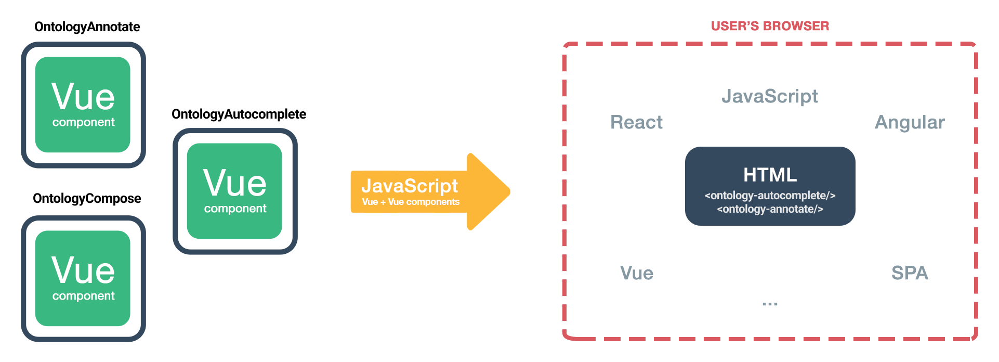

# ontology-elements

Web components are a set of standardized web platform APIs (Application Programming Interfaces) for creating reusable, encapsulated, and interoperable custom HTML elements. They allow developers to define their own HTML tags and elements with associated JavaScript logic, styles, and templates, which can then be used across multiple web pages and applications. Web components make it easier to build complex web applications by promoting modularity, reusability, and extensibility, and can improve the performance, maintainability, and accessibility of web content.

Ontology-Elements project aims at developing custom ontology rich html elements (web components). The primary benefit of custom html elements is that they can be used with any framework, or even without a framework. This makes them ideal for distributing components where the end consumer may not be using the same frontend stack, or when you want to insulate the end application from the implementation details of the components it uses.

Documentation: https://nfdi4chem.github.io/ontology-elements

Demo: https://nfdi4chem.github.io/ontology-elements/demo.html

## Help Desk

If you discover any issue or need any support please raise a ticket at our [Help Desk](https://helpdesk.nfdi4chem.de/).

## Features and Bugs

To raise request for any new feature or report any bug please add it to our [Github Issues](https://github.com/NFDI4Chem/ontology-elements/issues).

## License

Licensed under the [MIT license](https://opensource.org/licenses/MIT).

## Maintained by
Ontology-Elements is developed and maintained by the [NFDI4Chem partners](https://www.nfdi4chem.de/) at the [Friedrich Schiller University](https://www.uni-jena.de/en/) Jena, Germany. 
The code for this web application is released under the [MIT license](https://opensource.org/licenses/MIT).

## Acknowledgments

Funded by the [Deutsche Forschungsgemeinschaft (DFG, German Research Foundation)](https://www.dfg.de/) under the [National Research Data Infrastructure – NFDI4Chem](https://nfdi4chem.de/) – Projektnummer **441958208**.

