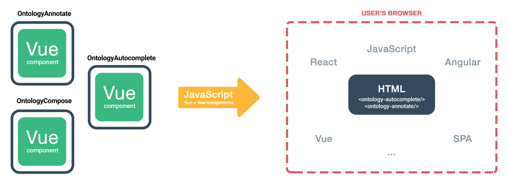

# Introduction

## Ontologies and controlled vocabulary

## Webcomponents

Web components are a set of standardized web platform APIs (Application Programming Interfaces) for creating reusable, encapsulated, and interoperable custom HTML elements. They allow developers to define their own HTML tags and elements with associated JavaScript logic, styles, and templates, which can then be used across multiple web pages and applications. Web components make it easier to build complex web applications by promoting modularity, reusability, and extensibility, and can improve the performance, maintainability, and accessibility of web content.

 The primary benefit of custom html elements is that they can be used with any framework, or even without a framework. This makes them ideal for distributing components where the end consumer may not be using the same frontend stack, or when you want to insulate the end application from the implementation details of the components it uses.

## Ontology-elements

Ontology-Elements project aims at developing custom ontology rich html elements (web components).

## Text Markup

### BRAT standoff format

## Ontology annotation - Standoff format

